# WYSIWID: Ejemplos Reales y Diagramas Comparativos

**Fecha**: Noviembre 2025
**Autores**: Daniel Jackson & Eagon Meng (MIT CSAIL)
**Patrón**: What You See Is What It Does

Este documento presenta ejemplos reales con diagramas en Mermaid.js que explican las diferencias y ventajas del patrón WYSIWID comparado con arquitecturas tradicionales.

---

## Índice

1. [Comparación Arquitectural Fundamental](#1-comparación-arquitectural-fundamental)
2. [Ejemplo Real: Sistema de Blog (RealWorld/Conduit)](#2-ejemplo-real-sistema-de-blog-realworldconduit)
3. [Ejemplo Real: Red Social (Instagram-like)](#3-ejemplo-real-red-social-instagram-like)
4. [Flujos de Datos: CRUD Operations](#4-flujos-de-datos-crud-operations)
5. [El Problema del "Favoriting"](#5-el-problema-del-favoriting)
6. [Ventajas para Desarrollo con LLMs](#6-ventajas-para-desarrollo-con-llms)
7. [Comparación con Microservicios](#7-comparación-con-microservicios)
8. [Casos de Uso Reales](#8-casos-de-uso-reales)

---

## 1. Comparación Arquitectural Fundamental

### 1.1 Arquitectura Tradicional (OOP/MVC)

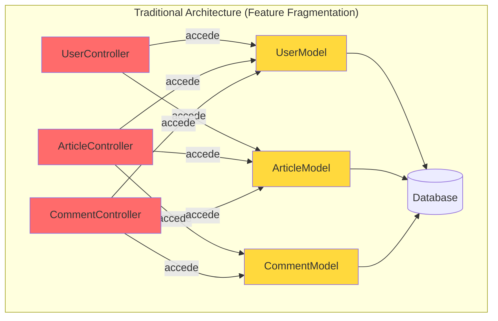
```mermaid
graph TB
    subgraph "Traditional Architecture (Feature Fragmentation)"
        UC[UserController]
        AC[ArticleController]
        CC[CommentController]

        UM[UserModel]
        AM[ArticleModel]
        CM[CommentModel]

        DB[(Database)]

        UC -->|accede| UM
        UC -->|accede| AM
        AC -->|accede| AM
        AC -->|accede| UM
        AC -->|accede| CM
        CC -->|accede| CM
        CC -->|accede| UM
        CC -->|accede| AM

        UM --> DB
        AM --> DB
        CM --> DB
    end

    style UC fill:#ff6b6b
    style AC fill:#ff6b6b
    style CC fill:#ff6b6b
    style UM fill:#ffd93d
    style AM fill:#ffd93d
    style CM fill:#ffd93d
```

**Problema**: Los controladores acceden múltiples modelos. La funcionalidad está fragmentada.

### 1.2 Arquitectura WYSIWID

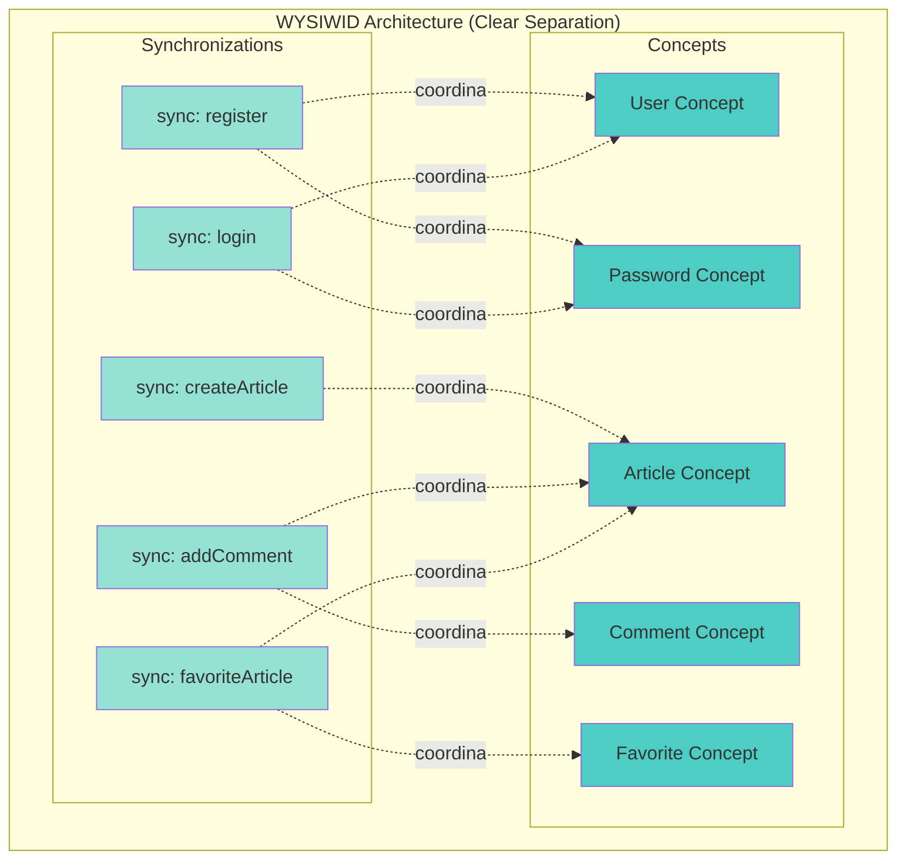
```mermaid
graph TB
    subgraph "WYSIWID Architecture (Clear Separation)"
        direction LR

        subgraph Concepts
            direction TB
            U[User Concept]
            P[Password Concept]
            A[Article Concept]
            C[Comment Concept]
            F[Favorite Concept]
        end

        subgraph Synchronizations
            direction TB
            S1[sync: register]
            S2[sync: login]
            S3[sync: createArticle]
            S4[sync: addComment]
            S5[sync: favoriteArticle]
        end

        S1 -.->|coordina| U
        S1 -.->|coordina| P
        S2 -.->|coordina| U
        S2 -.->|coordina| P
        S3 -.->|coordina| A
        S4 -.->|coordina| C
        S4 -.->|coordina| A
        S5 -.->|coordina| F
        S5 -.->|coordina| A
    end

    style U fill:#4ecdc4
    style P fill:#4ecdc4
    style A fill:#4ecdc4
    style C fill:#4ecdc4
    style F fill:#4ecdc4
    style S1 fill:#95e1d3
    style S2 fill:#95e1d3
    style S3 fill:#95e1d3
    style S4 fill:#95e1d3
    style S5 fill:#95e1d3
```

**Solución**: Conceptos independientes. Sincronizaciones como mediadoras puras.

### 1.3 Diferencia Clave: Dependencias

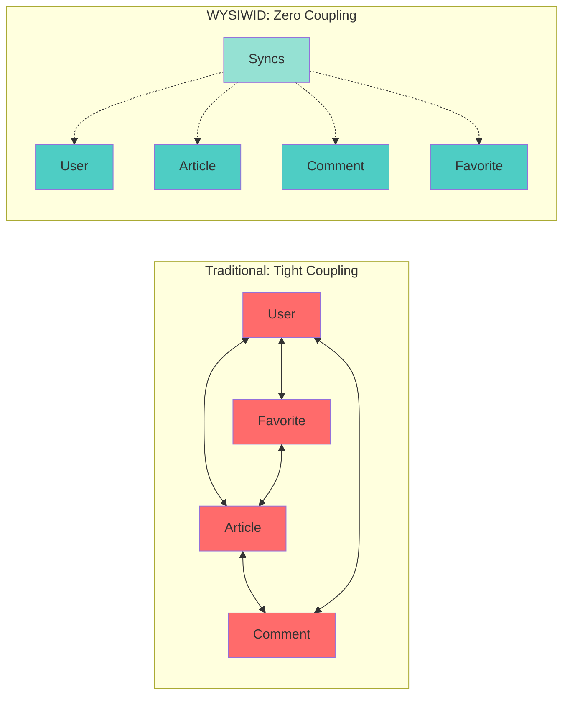
```mermaid
graph LR
    subgraph "Traditional: Tight Coupling"
        A1[User] <--> B1[Article]
        B1 <--> C1[Comment]
        C1 <--> A1
        A1 <--> D1[Favorite]
        D1 <--> B1
    end

    subgraph "WYSIWID: Zero Coupling"
        A2[User]
        B2[Article]
        C2[Comment]
        D2[Favorite]

        S[Syncs] -.-> A2
        S -.-> B2
        S -.-> C2
        S -.-> D2
    end

    style A1 fill:#ff6b6b
    style B1 fill:#ff6b6b
    style C1 fill:#ff6b6b
    style D1 fill:#ff6b6b
    style A2 fill:#4ecdc4
    style B2 fill:#4ecdc4
    style C2 fill:#4ecdc4
    style D2 fill:#4ecdc4
    style S fill:#95e1d3
```

---

## 2. Ejemplo Real: Sistema de Blog (RealWorld/Conduit)

### 2.1 Arquitectura Tradicional de Conduit

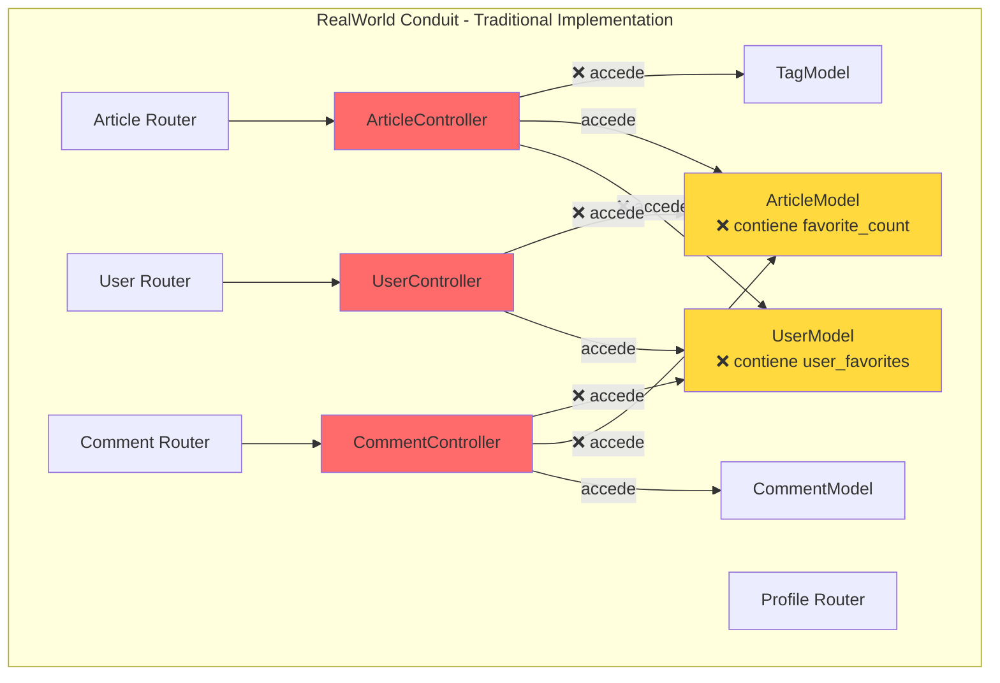
```mermaid
graph TD
    subgraph "RealWorld Conduit - Traditional Implementation"
        AR[Article Router]
        UR[User Router]
        CR[Comment Router]
        PR[Profile Router]

        ACtrl[ArticleController]
        UCtrl[UserController]
        CCtrl[CommentController]

        AM[ArticleModel<br/>❌ contiene favorite_count]
        UM[UserModel<br/>❌ contiene user_favorites]
        CM[CommentModel]
        TM[TagModel]

        AR --> ACtrl
        UR --> UCtrl
        CR --> CCtrl

        ACtrl -->|❌ accede| UM
        ACtrl -->|accede| AM
        ACtrl -->|❌ accede| TM

        UCtrl -->|accede| UM
        UCtrl -->|❌ accede| AM

        CCtrl -->|accede| CM
        CCtrl -->|❌ accede| AM
        CCtrl -->|❌ accede| UM
    end

    style ACtrl fill:#ff6b6b
    style UCtrl fill:#ff6b6b
    style CCtrl fill:#ff6b6b
    style AM fill:#ffd93d
    style UM fill:#ffd93d
```

**Violaciones Encontradas** (del paper):
- ❌ ArticleController accede UserModel y TagModel
- ❌ CommentController accede ArticleModel y UserModel
- ❌ Funcionalidad de "favoriting" dividida entre Article y User
- ❌ Routers acceden controladores que no les corresponden

### 2.2 Arquitectura WYSIWID de Conduit

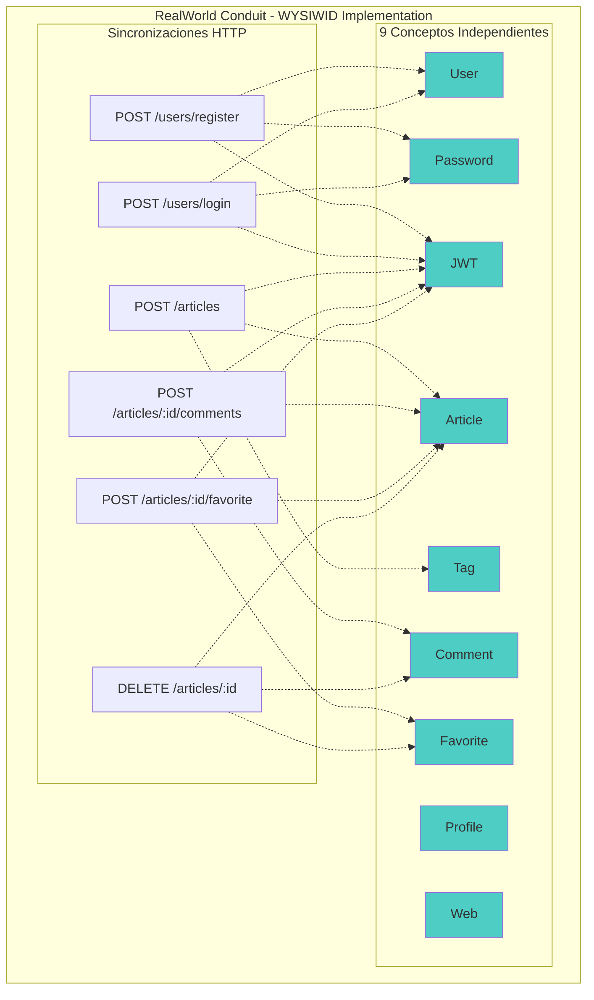
```mermaid
graph TB
    subgraph "RealWorld Conduit - WYSIWID Implementation"
        direction LR

        subgraph "9 Conceptos Independientes"
            direction TB
            U[User]
            PW[Password]
            PR[Profile]
            A[Article]
            C[Comment]
            T[Tag]
            F[Favorite]
            J[JWT]
            W[Web]
        end

        subgraph "Sincronizaciones HTTP"
            direction TB
            S1[POST /users/register]
            S2[POST /users/login]
            S3[POST /articles]
            S4[POST /articles/:id/comments]
            S5[POST /articles/:id/favorite]
            S6[DELETE /articles/:id]
        end

        S1 -.-> U
        S1 -.-> PW
        S1 -.-> J

        S2 -.-> U
        S2 -.-> PW
        S2 -.-> J

        S3 -.-> A
        S3 -.-> T
        S3 -.-> J

        S4 -.-> C
        S4 -.-> A
        S4 -.-> J

        S5 -.-> F
        S5 -.-> A
        S5 -.-> J

        S6 -.-> A
        S6 -.-> C
        S6 -.-> F
    end

    style U fill:#4ecdc4
    style PW fill:#4ecdc4
    style PR fill:#4ecdc4
    style A fill:#4ecdc4
    style C fill:#4ecdc4
    style T fill:#4ecdc4
    style F fill:#4ecdc4
    style J fill:#4ecdc4
    style W fill:#4ecdc4
```

**Ventajas**:
- ✅ Cada concepto es completamente independiente
- ✅ Favoriting es su propio concepto (no fragmentado)
- ✅ Mapeo directo: funcionalidad → concepto
- ✅ Testeable de forma aislada

---

## 3. Ejemplo Real: Red Social (Instagram-like)

### 3.1 Feature: "Compartir Post" (Share)

#### Arquitectura Tradicional

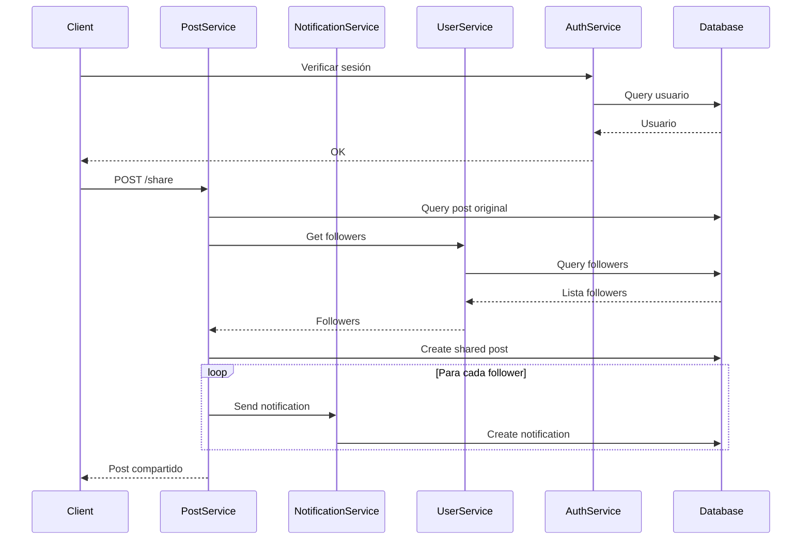
```mermaid
sequenceDiagram
    participant Client
    participant PostService
    participant NotificationService
    participant UserService
    participant AuthService
    participant Database

    Client->>AuthService: Verificar sesión
    AuthService->>Database: Query usuario
    Database-->>AuthService: Usuario
    AuthService-->>Client: OK

    Client->>PostService: POST /share
    PostService->>Database: Query post original
    PostService->>UserService: Get followers
    UserService->>Database: Query followers
    Database-->>UserService: Lista followers
    UserService-->>PostService: Followers

    PostService->>Database: Create shared post

    loop Para cada follower
        PostService->>NotificationService: Send notification
        NotificationService->>Database: Create notification
    end

    PostService-->>Client: Post compartido
```

**Problema**: El código de "compartir" está fragmentado en 4 servicios diferentes.

#### Arquitectura WYSIWID

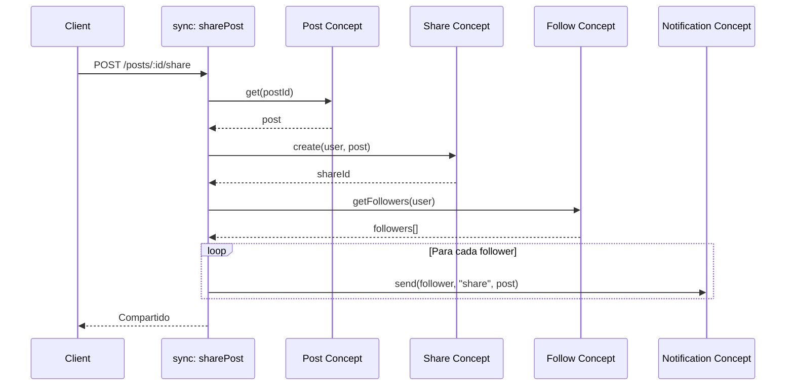
```mermaid
sequenceDiagram
    participant Client
    participant Sync as sync: sharePost
    participant Post as Post Concept
    participant Share as Share Concept
    participant Follow as Follow Concept
    participant Notif as Notification Concept

    Client->>Sync: POST /posts/:id/share

    Sync->>Post: get(postId)
    Post-->>Sync: post

    Sync->>Share: create(user, post)
    Share-->>Sync: shareId

    Sync->>Follow: getFollowers(user)
    Follow-->>Sync: followers[]

    loop Para cada follower
        Sync->>Notif: send(follower, "share", post)
    end

    Sync-->>Client: Compartido
```

**Solución**: La sincronización coordina conceptos independientes. Toda la lógica en un lugar.

### 3.2 Conceptos de Red Social

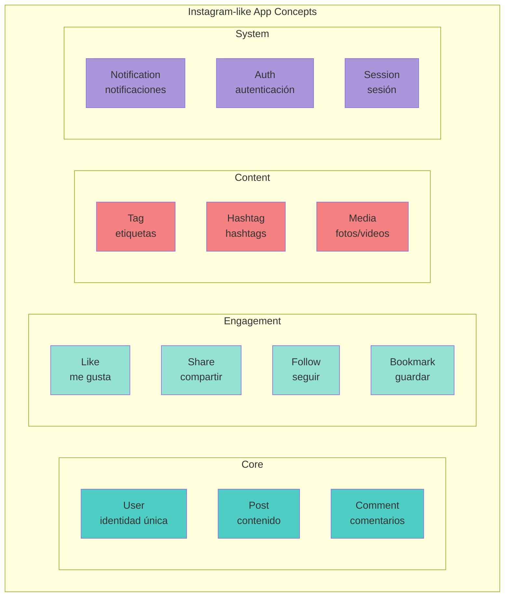
```mermaid
graph TB
    subgraph "Instagram-like App Concepts"
        direction LR

        subgraph Core
            U[User<br/>identidad única]
            P[Post<br/>contenido]
            C[Comment<br/>comentarios]
        end

        subgraph Engagement
            L[Like<br/>me gusta]
            S[Share<br/>compartir]
            F[Follow<br/>seguir]
            B[Bookmark<br/>guardar]
        end

        subgraph Content
            T[Tag<br/>etiquetas]
            H[Hashtag<br/>hashtags]
            M[Media<br/>fotos/videos]
        end

        subgraph System
            N[Notification<br/>notificaciones]
            A[Auth<br/>autenticación]
            SE[Session<br/>sesión]
        end
    end

    style U fill:#4ecdc4
    style P fill:#4ecdc4
    style C fill:#4ecdc4
    style L fill:#95e1d3
    style S fill:#95e1d3
    style F fill:#95e1d3
    style B fill:#95e1d3
    style T fill:#f38181
    style H fill:#f38181
    style M fill:#f38181
    style N fill:#aa96da
    style A fill:#aa96da
    style SE fill:#aa96da
```

---

## 4. Flujos de Datos: CRUD Operations

### 4.1 Crear Artículo con Etiquetas (Traditional)

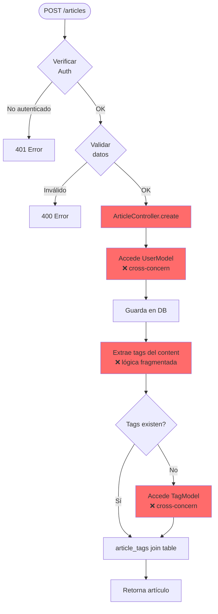
```mermaid
flowchart TD
    Start([POST /articles]) --> Auth{Verificar<br/>Auth}
    Auth -->|No autenticado| Error1[401 Error]
    Auth -->|OK| Validate{Validar<br/>datos}
    Validate -->|Inválido| Error2[400 Error]
    Validate -->|OK| CreateArticle[ArticleController.create]

    CreateArticle --> QueryUser[Accede UserModel<br/>❌ cross-concern]
    QueryUser --> SaveArticle[Guarda en DB]
    SaveArticle --> ExtractTags[Extrae tags del content<br/>❌ lógica fragmentada]

    ExtractTags --> CheckTags{Tags existen?}
    CheckTags -->|No| CreateTags[Accede TagModel<br/>❌ cross-concern]
    CheckTags -->|Sí| LinkTags[article_tags join table]
    CreateTags --> LinkTags

    LinkTags --> Response[Retorna artículo]

    style CreateArticle fill:#ff6b6b
    style QueryUser fill:#ff6b6b
    style ExtractTags fill:#ff6b6b
    style CreateTags fill:#ff6b6b
```

### 4.2 Crear Artículo con Etiquetas (WYSIWID)

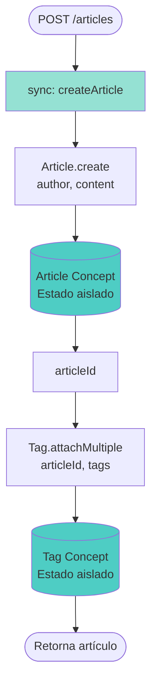
```mermaid
flowchart TD
    Start([POST /articles]) --> Sync[sync: createArticle]

    Sync --> Action1[Article.create<br/>author, content]
    Action1 --> Article[(Article Concept<br/>Estado aislado)]
    Article --> ArticleId[articleId]

    ArticleId --> Action2[Tag.attachMultiple<br/>articleId, tags]
    Action2 --> Tag[(Tag Concept<br/>Estado aislado)]
    Tag --> Done

    Done([Retorna artículo])

    style Sync fill:#95e1d3
    style Article fill:#4ecdc4
    style Tag fill:#4ecdc4
```

**Diferencia Clave**:
- **Traditional**: Controlador accede múltiples modelos directamente (acoplamiento)
- **WYSIWID**: Sincronización invoca acciones de conceptos (sin acoplamiento)

---

## 5. El Problema del "Favoriting"

Este es el ejemplo más citado del paper para mostrar fragmentación de features.

### 5.1 Arquitectura Tradicional

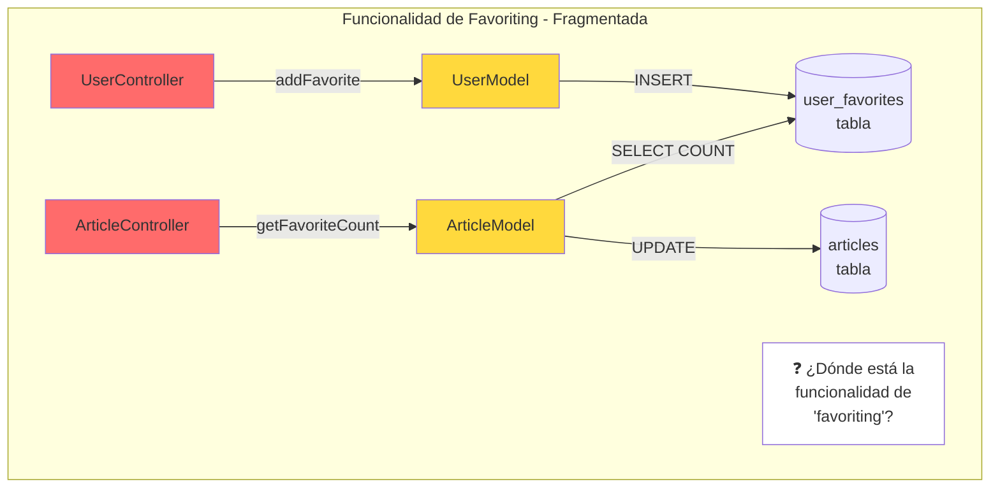
```mermaid
graph TD
    subgraph "Funcionalidad de Favoriting - Fragmentada"
        UC[UserController]
        AC[ArticleController]

        UM[UserModel]
        AM[ArticleModel]

        UFT[(user_favorites<br/>tabla)]
        ART[(articles<br/>tabla)]

        UC -->|addFavorite| UM
        UM -->|INSERT| UFT

        AC -->|getFavoriteCount| AM
        AM -->|SELECT COUNT| UFT
        AM -->|UPDATE| ART

        Question["❓ ¿Dónde está la<br/>funcionalidad de<br/>'favoriting'?"]
    end

    style UC fill:#ff6b6b
    style AC fill:#ff6b6b
    style UM fill:#ffd93d
    style AM fill:#ffd93d
    style Question fill:#fff
```

**Preguntas sin respuesta clara**:
- ¿Dónde vivo el código de favoriting?
- ¿Cómo testeo esta funcionalidad?
- ¿Cómo reutilizo favoriting para otros items (comments, photos)?

### 5.2 Arquitectura WYSIWID

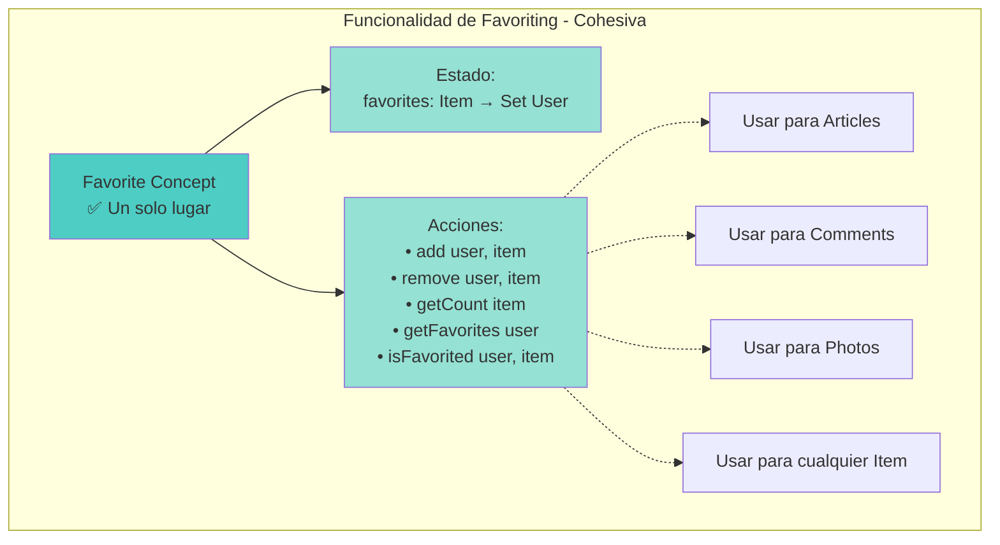
```mermaid
graph TB
    subgraph "Funcionalidad de Favoriting - Cohesiva"
        FC[Favorite Concept<br/>✅ Un solo lugar]

        State[Estado:<br/>favorites: Item → Set User]

        Actions[Acciones:<br/>• add user, item<br/>• remove user, item<br/>• getCount item<br/>• getFavorites user<br/>• isFavorited user, item]

        FC --> State
        FC --> Actions

        Use1[Usar para Articles]
        Use2[Usar para Comments]
        Use3[Usar para Photos]
        Use4[Usar para cualquier Item]

        Actions -.-> Use1
        Actions -.-> Use2
        Actions -.-> Use3
        Actions -.-> Use4
    end

    style FC fill:#4ecdc4
    style State fill:#95e1d3
    style Actions fill:#95e1d3
```

**Respuestas claras**:
- ✅ Todo el código en `Favorite Concept`
- ✅ Tests aislados del concepto
- ✅ Reutilizable para cualquier tipo de item (polimorfismo)

### 5.3 Código Comparado

#### Traditional (Fragmentado)

```typescript
// En UserController.ts
class UserController {
  async addFavorite(req, res) {
    const { articleId } = req.body;
    const userId = req.session.userId;

    // ❌ Lógica mezclada con User
    await User.findByIdAndUpdate(userId, {
      $push: { favorites: articleId }
    });

    // ❌ Accede Article model (cross-concern)
    await Article.findByIdAndUpdate(articleId, {
      $inc: { favoriteCount: 1 }
    });

    res.json({ msg: "Favorited" });
  }
}

// En ArticleController.ts
class ArticleController {
  async getArticle(req, res) {
    const article = await Article.findById(req.params.id);

    // ❌ Accede User model (cross-concern)
    const favoriteCount = await User.countDocuments({
      favorites: article._id
    });

    res.json({ ...article, favoriteCount });
  }
}
```

#### WYSIWID (Cohesivo)

```typescript
// En favorite.ts - TODO está aquí
class FavoriteConcept {
  private favorites: Map<ItemId, Set<UserId>>;

  async add(user: UserId, item: ItemId) {
    if (!this.favorites.has(item)) {
      this.favorites.set(item, new Set());
    }
    this.favorites.get(item)!.add(user);
  }

  async remove(user: UserId, item: ItemId) {
    this.favorites.get(item)?.delete(user);
  }

  async getCount(item: ItemId): number {
    return this.favorites.get(item)?.size ?? 0;
  }

  async isFavorited(user: UserId, item: ItemId): boolean {
    return this.favorites.get(item)?.has(user) ?? false;
  }

  async getFavorites(user: UserId): ItemId[] {
    const results: ItemId[] = [];
    for (const [item, users] of this.favorites) {
      if (users.has(user)) results.push(item);
    }
    return results;
  }
}

// En routes.ts - Sincronización simple
router.post("/articles/:id/favorite", async (req, res) => {
  const userId = Session.getUser(req);
  const articleId = req.params.id;

  await Concepts.favorite.add(userId, articleId);

  res.json({ msg: "Favorited" });
});
```

---

## 6. Ventajas para Desarrollo con LLMs

### 6.1 Tamaño de Contexto

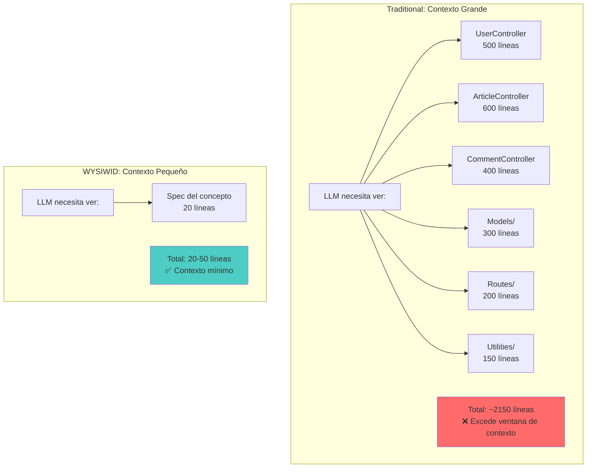
```mermaid
graph TB
    subgraph "Traditional: Contexto Grande"
        LLM1[LLM necesita ver:]

        C1[UserController<br/>500 líneas]
        C2[ArticleController<br/>600 líneas]
        C3[CommentController<br/>400 líneas]
        C4[Models/<br/>300 líneas]
        C5[Routes/<br/>200 líneas]
        C6[Utilities/<br/>150 líneas]

        LLM1 --> C1
        LLM1 --> C2
        LLM1 --> C3
        LLM1 --> C4
        LLM1 --> C5
        LLM1 --> C6

        Total1[Total: ~2150 líneas<br/>❌ Excede ventana de contexto]
    end

    subgraph "WYSIWID: Contexto Pequeño"
        LLM2[LLM necesita ver:]

        Spec[Spec del concepto<br/>20 líneas]

        LLM2 --> Spec

        Total2[Total: 20-50 líneas<br/>✅ Contexto mínimo]
    end

    style Total1 fill:#ff6b6b
    style Total2 fill:#4ecdc4
```

### 6.2 Proceso de Generación

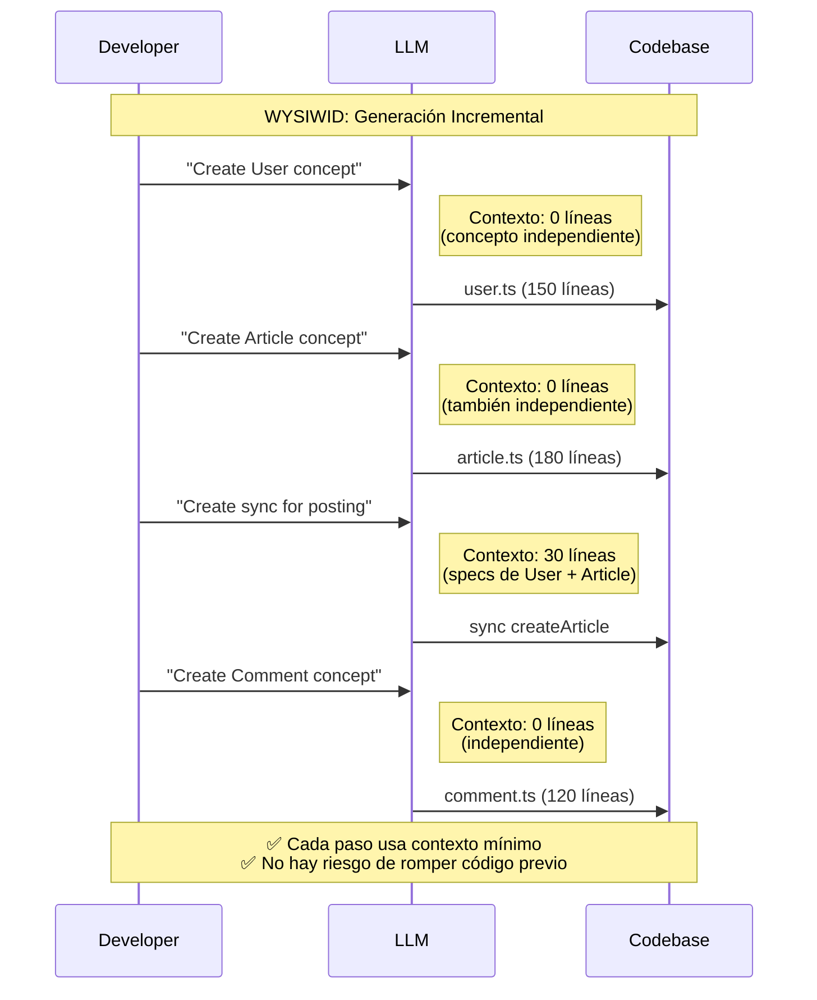
```mermaid
sequenceDiagram
    participant Dev as Developer
    participant LLM
    participant Code as Codebase

    Note over Dev,Code: WYSIWID: Generación Incremental

    Dev->>LLM: "Create User concept"
    Note right of LLM: Contexto: 0 líneas<br/>(concepto independiente)
    LLM->>Code: user.ts (150 líneas)

    Dev->>LLM: "Create Article concept"
    Note right of LLM: Contexto: 0 líneas<br/>(también independiente)
    LLM->>Code: article.ts (180 líneas)

    Dev->>LLM: "Create sync for posting"
    Note right of LLM: Contexto: 30 líneas<br/>(specs de User + Article)
    LLM->>Code: sync createArticle

    Dev->>LLM: "Create Comment concept"
    Note right of LLM: Contexto: 0 líneas<br/>(independiente)
    LLM->>Code: comment.ts (120 líneas)

    Note over Dev,Code: ✅ Cada paso usa contexto mínimo<br/>✅ No hay riesgo de romper código previo
```

### 6.3 Comparación de Errores

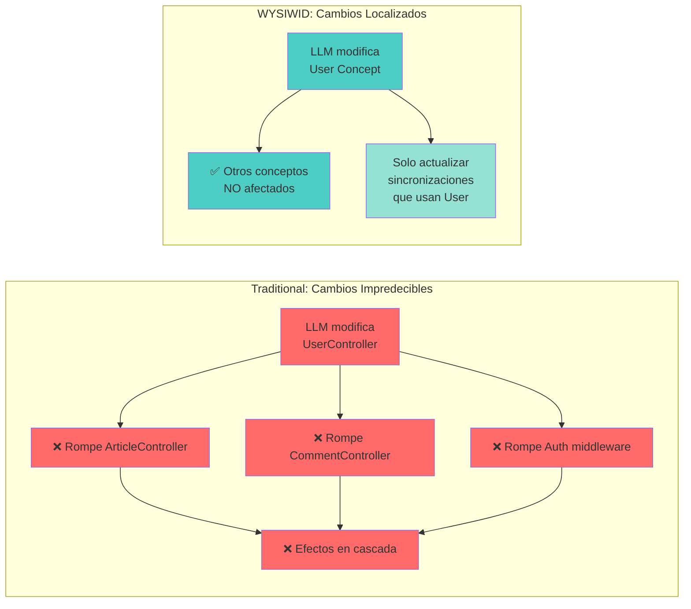
```mermaid
graph LR
    subgraph "Traditional: Cambios Impredecibles"
        Change1[LLM modifica<br/>UserController]

        Break1[❌ Rompe ArticleController]
        Break2[❌ Rompe CommentController]
        Break3[❌ Rompe Auth middleware]
        Break4[❌ Efectos en cascada]

        Change1 --> Break1
        Change1 --> Break2
        Change1 --> Break3
        Break1 --> Break4
        Break2 --> Break4
        Break3 --> Break4
    end

    subgraph "WYSIWID: Cambios Localizados"
        Change2[LLM modifica<br/>User Concept]

        NoBreak[✅ Otros conceptos<br/>NO afectados]
        SyncUpdate[Solo actualizar<br/>sincronizaciones<br/>que usan User]

        Change2 --> NoBreak
        Change2 --> SyncUpdate
    end

    style Change1 fill:#ff6b6b
    style Break1 fill:#ff6b6b
    style Break2 fill:#ff6b6b
    style Break3 fill:#ff6b6b
    style Break4 fill:#ff6b6b
    style Change2 fill:#4ecdc4
    style NoBreak fill:#4ecdc4
    style SyncUpdate fill:#95e1d3
```

### 6.4 Datos Reales: Kodless MIT

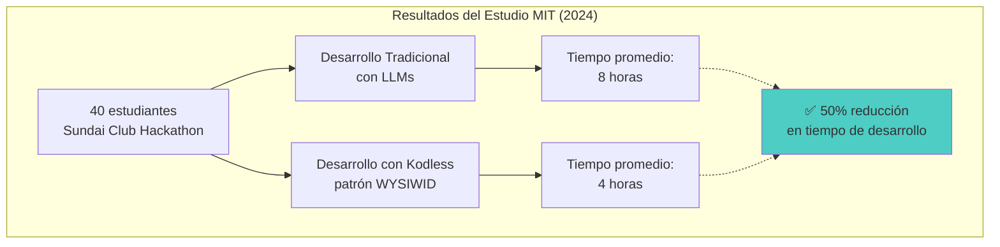
```mermaid
graph TB
    subgraph "Resultados del Estudio MIT (2024)"
        direction LR

        Students[40 estudiantes<br/>Sundai Club Hackathon]

        Traditional[Desarrollo Tradicional<br/>con LLMs]
        WYSIWID[Desarrollo con Kodless<br/>patrón WYSIWID]

        Students --> Traditional
        Students --> WYSIWID

        TimeT[Tiempo promedio:<br/>8 horas]
        TimeW[Tiempo promedio:<br/>4 horas]

        Traditional --> TimeT
        WYSIWID --> TimeW

        Result[✅ 50% reducción<br/>en tiempo de desarrollo]

        TimeT -.-> Result
        TimeW -.-> Result
    end

    style Result fill:#4ecdc4
```

---

## 7. Comparación con Microservicios

### 7.1 Microservicios Tradicionales

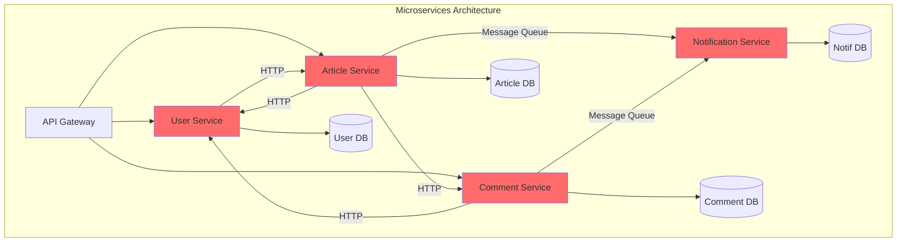
```mermaid
graph TB
    subgraph "Microservices Architecture"
        Gateway[API Gateway]

        UserMS[User Service]
        ArticleMS[Article Service]
        CommentMS[Comment Service]
        NotifMS[Notification Service]

        Gateway --> UserMS
        Gateway --> ArticleMS
        Gateway --> CommentMS

        UserMS -->|HTTP| ArticleMS
        ArticleMS -->|HTTP| UserMS
        ArticleMS -->|HTTP| CommentMS
        CommentMS -->|HTTP| UserMS
        ArticleMS -->|Message Queue| NotifMS
        CommentMS -->|Message Queue| NotifMS

        UserDB[(User DB)]
        ArticleDB[(Article DB)]
        CommentDB[(Comment DB)]
        NotifDB[(Notif DB)]

        UserMS --> UserDB
        ArticleMS --> ArticleDB
        CommentMS --> CommentDB
        NotifMS --> NotifDB
    end

    style UserMS fill:#ff6b6b
    style ArticleMS fill:#ff6b6b
    style CommentMS fill:#ff6b6b
    style NotifMS fill:#ff6b6b
```

**Problemas**:
- ❌ Servicios se llaman entre sí (acoplamiento)
- ❌ Complejidad operacional (deployment, monitoring)
- ❌ Latencia de red entre servicios
- ❌ Difícil rastrear flujos completos

### 7.2 WYSIWID Concepts

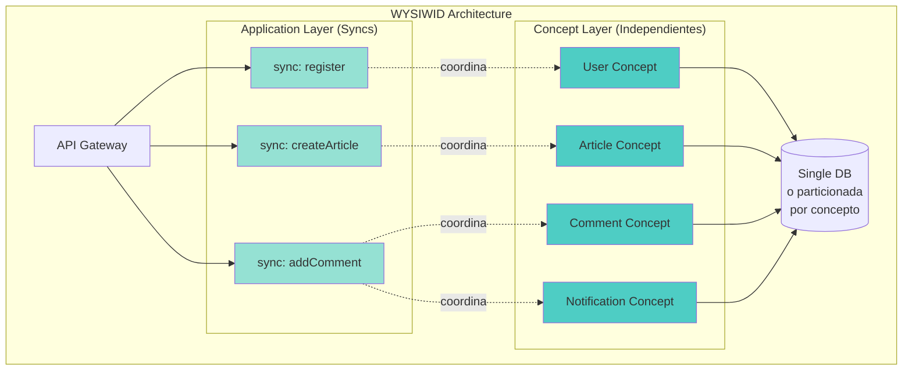
```mermaid
graph TB
    subgraph "WYSIWID Architecture"
        Gateway[API Gateway]

        subgraph "Application Layer (Syncs)"
            S1[sync: register]
            S2[sync: createArticle]
            S3[sync: addComment]
        end

        subgraph "Concept Layer (Independientes)"
            User[User Concept]
            Article[Article Concept]
            Comment[Comment Concept]
            Notif[Notification Concept]
        end

        Gateway --> S1
        Gateway --> S2
        Gateway --> S3

        S1 -.->|coordina| User
        S2 -.->|coordina| Article
        S3 -.->|coordina| Comment
        S3 -.->|coordina| Notif

        DB[(Single DB<br/>o particionada<br/>por concepto)]

        User --> DB
        Article --> DB
        Comment --> DB
        Notif --> DB
    end

    style User fill:#4ecdc4
    style Article fill:#4ecdc4
    style Comment fill:#4ecdc4
    style Notif fill:#4ecdc4
    style S1 fill:#95e1d3
    style S2 fill:#95e1d3
    style S3 fill:#95e1d3
```

**Ventajas**:
- ✅ Conceptos NO se llaman entre sí (cero acoplamiento)
- ✅ Puede ser monolito (simple deployment)
- ✅ Sin latencia de red
- ✅ Provenance tracking integrado

### 7.3 Tabla Comparativa

| Aspecto | Microservicios | WYSIWID |
|---------|---------------|---------|
| **Granularidad** | Por servicio (User Service, Article Service) | Por concepto (User, Article) |
| **Comunicación** | HTTP/gRPC entre servicios | Sincronizaciones declarativas |
| **Acoplamiento** | Alto (servicios se llaman) | Cero (conceptos independientes) |
| **Deployment** | Múltiples procesos/containers | Puede ser monolito o distribuido |
| **Testing** | Requiere mocks de servicios | Tests aislados por concepto |
| **Debugging** | Difícil (logs distribuidos) | Fácil (provenance graph) |
| **LLM Generation** | Difícil (contexto distribuido) | Fácil (un concepto a la vez) |
| **Base de Datos** | DB por servicio | Flexible (shared o separada) |

---

## 8. Casos de Uso Reales

### 8.1 E-Commerce: Proceso de Checkout

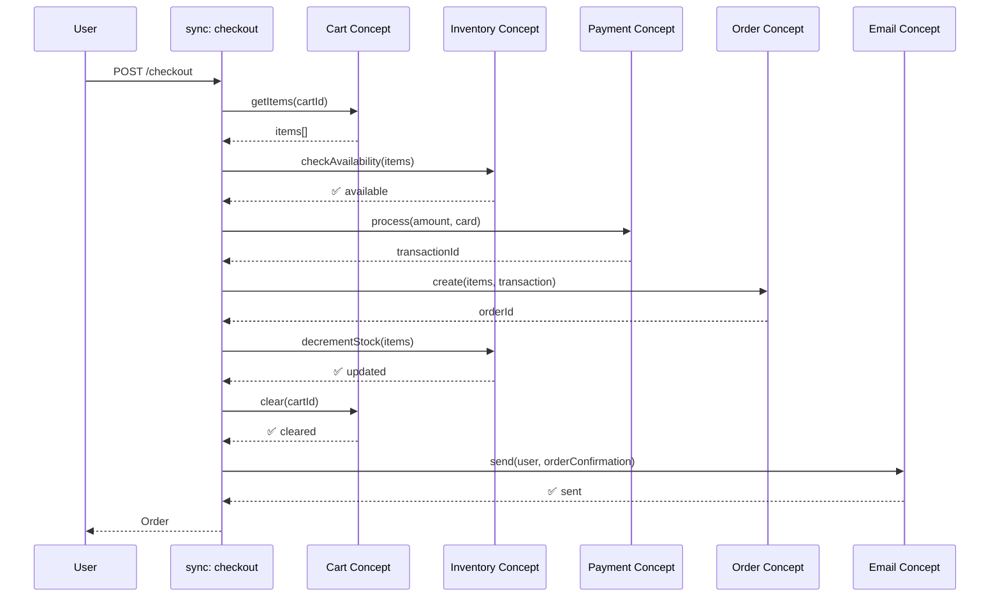
```mermaid
sequenceDiagram
    participant User
    participant Sync as sync: checkout
    participant Cart as Cart Concept
    participant Inventory as Inventory Concept
    participant Payment as Payment Concept
    participant Order as Order Concept
    participant Email as Email Concept

    User->>Sync: POST /checkout

    Sync->>Cart: getItems(cartId)
    Cart-->>Sync: items[]

    Sync->>Inventory: checkAvailability(items)
    Inventory-->>Sync: ✅ available

    Sync->>Payment: process(amount, card)
    Payment-->>Sync: transactionId

    Sync->>Order: create(items, transaction)
    Order-->>Sync: orderId

    Sync->>Inventory: decrementStock(items)
    Inventory-->>Sync: ✅ updated

    Sync->>Cart: clear(cartId)
    Cart-->>Sync: ✅ cleared

    Sync->>Email: send(user, orderConfirmation)
    Email-->>Sync: ✅ sent

    Sync-->>User: Order #12345 confirmed
```

**Ventaja**: Toda la lógica de checkout en una sincronización. Fácil de entender y modificar.

### 8.2 Sistema Educativo: Completar Curso

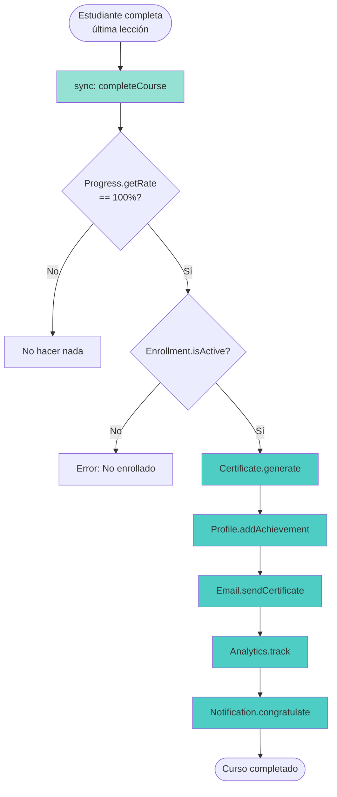
```mermaid
graph TB
    Start([Estudiante completa<br/>última lección]) --> Sync[sync: completeCourse]

    Sync --> Check1{Progress.getRate<br/>== 100%?}
    Check1 -->|No| End1[No hacer nada]
    Check1 -->|Sí| Check2{Enrollment.isActive?}

    Check2 -->|No| End2[Error: No enrollado]
    Check2 -->|Sí| Action1[Certificate.generate]

    Action1 --> Action2[Profile.addAchievement]
    Action2 --> Action3[Email.sendCertificate]
    Action3 --> Action4[Analytics.track]
    Action4 --> Action5[Notification.congratulate]

    Action5 --> End3([Curso completado])

    style Sync fill:#95e1d3
    style Action1 fill:#4ecdc4
    style Action2 fill:#4ecdc4
    style Action3 fill:#4ecdc4
    style Action4 fill:#4ecdc4
    style Action5 fill:#4ecdc4
```

### 8.3 Healthcare: Agendar Cita Médica

```mermaid
flowchart TD
    Request([POST /appointments]) --> Sync[sync: scheduleAppointment]

    Sync --> V1{Patient.exists?}
    V1 -->|No| E1[Error: Paciente<br/>no encontrado]
    V1 -->|Sí| V2{Doctor.isAvailable<br/>datetime?}

    V2 -->|No| E2[Error: Doctor<br/>no disponible]
    V2 -->|Sí| V3{Insurance.isValid<br/>patient?}

    V3 -->|No| E3[Error: Seguro<br/>inválido]
    V3 -->|Sí| A1[Appointment.create]

    A1 --> A2[Calendar.block<br/>doctor, time]
    A2 --> A3[Notification.send<br/>patient, doctor]
    A3 --> A4[Reminder.schedule<br/>24h before]
    A4 --> A5[Billing.prepare<br/>insurance claim]

    A5 --> Success([Cita agendada<br/>✅])

    style Sync fill:#95e1d3
    style A1 fill:#4ecdc4
    style A2 fill:#4ecdc4
    style A3 fill:#4ecdc4
    style A4 fill:#4ecdc4
    style A5 fill:#4ecdc4
```

**Conceptos Involucrados**:
- Patient (información del paciente)
- Doctor (disponibilidad, especialidad)
- Appointment (citas)
- Calendar (bloqueo de horarios)
- Insurance (verificación de cobertura)
- Notification (alertas)
- Reminder (recordatorios)
- Billing (facturación)

**Ventaja**: Cada concepto es reutilizable. Por ejemplo, Calendar se puede usar también para salas de conferencia, equipos médicos, etc.

---

## 9. Visualización de Provenance (Debugging)

### 9.1 Flujo con Errores - Traditional

```mermaid
graph TB
    Request[HTTP Request] --> Controller1[UserController]
    Controller1 --> Model1[UserModel]
    Model1 --> DB1[(DB Query)]
    DB1 --> Error1[❌ Error en DB]

    Error1 -.->|???| Unknown[¿Qué causó esto?<br/>¿UserController?<br/>¿ArticleController?<br/>¿CommentController?]

    style Error1 fill:#ff6b6b
    style Unknown fill:#ffd93d
```

**Problema**: Difícil rastrear la causalidad del error.

### 9.2 Flujo con Errores - WYSIWID Provenance

```mermaid
graph LR
    subgraph "Flow #abc123 - Provenance Graph"
        A1[act_1<br/>Web.request<br/>POST /register] --> A2[act_2<br/>User.create<br/>username: alice]
        A2 --> A3[act_3<br/>Password.set<br/>user: alice]
        A3 --> A4[act_4<br/>Profile.create<br/>user: alice]
        A4 --> A5[act_5<br/>Email.send<br/>❌ FAILED]

        A1 -.->|caused by| A2
        A2 -.->|caused by| A3
        A3 -.->|caused by| A4
        A4 -.->|caused by| A5
    end

    style A5 fill:#ff6b6b
```

**Solución**: Provenance graph muestra exactamente qué causó qué.

### 9.3 Estructura de Provenance

```mermaid
classDiagram
    class ActionRecord {
        +string id
        +string flow
        +string concept
        +string action
        +object args
        +object result
        +DateTime timestamp
        +string causedBy
    }

    class ProvenanceGraph {
        +ActionRecord[] actions
        +getFlow(flowId)
        +getCause(actionId)
        +getEffects(actionId)
        +visualize()
    }

    ProvenanceGraph "1" --> "*" ActionRecord
```

**Uso para Debugging**:
```typescript
// Obtener todas las acciones de un request
const flow = provenance.getFlow("flow_abc123");

// Ver qué causó un error
const errorAction = flow.find(a => a.result.error);
const cause = provenance.getCause(errorAction.causedBy);

// Mostrar a LLM para diagnóstico
const prompt = `This error occurred:
${JSON.stringify(errorAction)}

It was caused by:
${JSON.stringify(cause)}

Full flow:
${JSON.stringify(flow)}

What's the issue?`;
```

---

## 10. Migración: De Traditional a WYSIWID

### 10.1 Proceso de Migración

```mermaid
graph TB
    subgraph "Paso 1: Identificar Conceptos"
        Old[Codebase Tradicional]
        Analyze[Analizar funcionalidad]

        Old --> Analyze

        Identify[Identificar conceptos:<br/>• User<br/>• Post<br/>• Comment<br/>• Like<br/>• etc.]

        Analyze --> Identify
    end

    subgraph "Paso 2: Extraer Estado"
        Extract[Extraer estado de cada concepto]

        UserState[User Concept State:<br/>users, passwords]
        PostState[Post Concept State:<br/>posts, content, authors]

        Identify --> Extract
        Extract --> UserState
        Extract --> PostState
    end

    subgraph "Paso 3: Definir Acciones"
        Define[Definir acciones por concepto]

        UserActions[User Actions:<br/>create, authenticate, delete]
        PostActions[Post Actions:<br/>create, update, delete, getByAuthor]

        UserState --> Define
        PostState --> Define
        Define --> UserActions
        Define --> PostActions
    end

    subgraph "Paso 4: Crear Sincronizaciones"
        Routes[Convertir routes a syncs]

        Sync1[sync: register → User.create + Session.start]
        Sync2[sync: createPost → Post.create]

        UserActions --> Routes
        PostActions --> Routes
        Routes --> Sync1
        Routes --> Sync2
    end

    subgraph "Paso 5: Testing"
        Test[Tests aislados por concepto]
        Integration[Tests de integración de syncs]

        Sync1 --> Test
        Sync2 --> Test
        Test --> Integration
    end

    style Identify fill:#4ecdc4
    style UserActions fill:#95e1d3
    style PostActions fill:#95e1d3
    style Sync1 fill:#f38181
    style Sync2 fill:#f38181
```

### 10.2 Antes y Después: Código Real

#### Antes (Traditional MVC)

```typescript
// controllers/ArticleController.ts
class ArticleController {
  async create(req, res) {
    // Lógica mezclada
    const { title, content, tags } = req.body;
    const userId = req.session.userId;

    // Accede múltiples modelos
    const user = await User.findById(userId);
    if (!user) return res.status(401).json({ error: "Unauthorized" });

    const article = await Article.create({
      title,
      content,
      author: userId,
      createdAt: new Date()
    });

    // Lógica de tags aquí también
    for (const tag of tags) {
      let tagDoc = await Tag.findOne({ name: tag });
      if (!tagDoc) {
        tagDoc = await Tag.create({ name: tag });
      }
      await ArticleTag.create({
        article: article._id,
        tag: tagDoc._id
      });
    }

    // Notificar followers
    const followers = await Follow.find({ following: userId });
    for (const follower of followers) {
      await Notification.create({
        user: follower.follower,
        type: "new_article",
        article: article._id
      });
    }

    res.json(article);
  }
}
```

#### Después (WYSIWID)

```typescript
// concepts/article.ts
class ArticleConcept {
  async create(author: UserId, title: string, content: string) {
    const id = generateId();
    await this.articles.insert({ id, author, title, content, createdAt: new Date() });
    return { id, author, title, content };
  }
}

// concepts/tag.ts
class TagConcept {
  async attach(item: ItemId, tags: string[]) {
    for (const tag of tags) {
      if (!this.tags.has(tag)) {
        this.tags.set(tag, new Set());
      }
      this.tags.get(tag)!.add(item);
    }
  }
}

// concepts/follow.ts
class FollowConcept {
  async getFollowers(user: UserId): UserId[] {
    return Array.from(this.followers.get(user) ?? []);
  }
}

// concepts/notification.ts
class NotificationConcept {
  async send(user: UserId, type: string, data: any) {
    await this.notifications.insert({ user, type, data, createdAt: new Date() });
  }
}

// routes.ts
router.post("/articles", async (req, res) => {
  // sync: createArticle
  const { title, content, tags } = req.body;
  const userId = Session.getUser(req);

  // Coordinar conceptos
  const article = await Concepts.article.create(userId, title, content);
  await Concepts.tag.attach(article.id, tags);

  const followers = await Concepts.follow.getFollowers(userId);
  for (const follower of followers) {
    await Concepts.notification.send(follower, "new_article", { articleId: article.id });
  }

  res.json(article);
});
```

**Mejoras**:
- ✅ Cada concepto testeable aisladamente
- ✅ Lógica cohesiva y localizada
- ✅ Reutilizable (Tag, Notification para otros tipos)
- ✅ Fácil de generar con LLM (pequeños módulos)

---

## 11. Conclusiones y Mejores Prácticas

### 11.1 Cuándo Usar WYSIWID

```mermaid
graph TD
    Start{Nuevo Proyecto?} -->|Sí| Good1[✅ Ideal para WYSIWID]
    Start -->|No| Existing{Codebase Existente}

    Existing --> Size{Tamaño}
    Size -->|Pequeño <5k LOC| Good2[✅ Migración factible]
    Size -->|Mediano 5-50k| Maybe[⚠️ Migración gradual]
    Size -->|Grande >50k| Hard[❌ Costoso migrar todo<br/>Considerar para nuevos features]

    Good1 --> Benefits
    Good2 --> Benefits
    Maybe --> Incremental[Migrar módulo por módulo]
    Incremental --> Benefits

    Benefits[Beneficios:<br/>• LLM-friendly<br/>• Testeable<br/>• Modular<br/>• Mantenible]

    style Good1 fill:#4ecdc4
    style Good2 fill:#4ecdc4
    style Benefits fill:#95e1d3
```

### 11.2 Checklist de Concepto Válido

```mermaid
graph TB
    Concept[¿Es un Concepto Válido?]

    Concept --> Q1{¿Tiene UN propósito claro?}
    Q1 -->|No| Fix1[Dividir en múltiples conceptos]
    Q1 -->|Sí| Q2{¿Es completamente<br/>independiente?}

    Q2 -->|No| Fix2[Eliminar dependencias<br/>de otros conceptos]
    Q2 -->|Sí| Q3{¿Puede ser reutilizado<br/>en otros contextos?}

    Q3 -->|No| Fix3[Generalizar usando<br/>polimorfismo]
    Q3 -->|Sí| Q4{¿Tiene estado y<br/>acciones bien definidas?}

    Q4 -->|No| Fix4[Definir explícitamente<br/>estado y acciones]
    Q4 -->|Sí| Valid[✅ Concepto Válido]

    style Valid fill:#4ecdc4
    style Fix1 fill:#ffd93d
    style Fix2 fill:#ffd93d
    style Fix3 fill:#ffd93d
    style Fix4 fill:#ffd93d
```

### 11.3 Ventajas Resumidas

```mermaid
mindmap
  root((WYSIWID<br/>Ventajas))
    Modularidad
      Conceptos independientes
      Sin acoplamiento
      Fácil testing
      Reutilizables
    LLM-Friendly
      Contexto pequeño
      Generación incremental
      Menos errores
      Refinamiento fácil
    Mantenibilidad
      Funcionalidad localizada
      Fácil de entender
      Cambios seguros
      Debugging simple
    Escalabilidad
      De monolito a distribuido
      Sin cambios de código
      Provenance tracking
      Performance predecible
```

---

## Referencias

- **Paper**: Jackson, D. & Meng, E. (2024). "What You See Is What It Does: A Structural Pattern for Legible Software". SPLASH Onward! 2024. https://arxiv.org/abs/2508.14511

- **Libro**: Jackson, D. (2021). "The Essence of Software: Why Concepts Matter for Great Design". Princeton University Press.

- **Implementación**: Kodless - https://github.com/kodless-org/kodless

- **Curso**: MIT 6.1040: Software Design - https://61040-fa25.github.io/

- **Blog**: https://essenceofsoftware.com/posts/wysiwid/

---

**Nota**: Este documento fue creado en Noviembre 2025 basado en investigación publicada y casos de uso reales del patrón WYSIWID.
